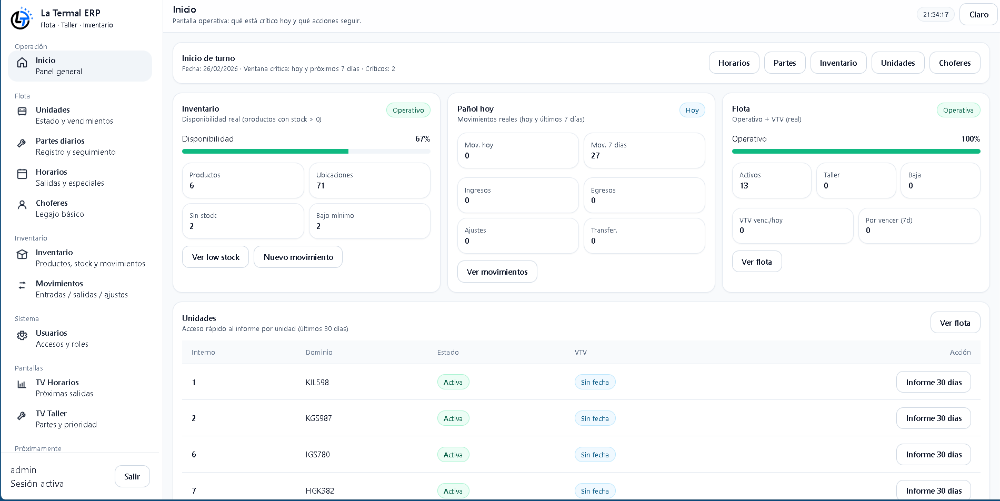
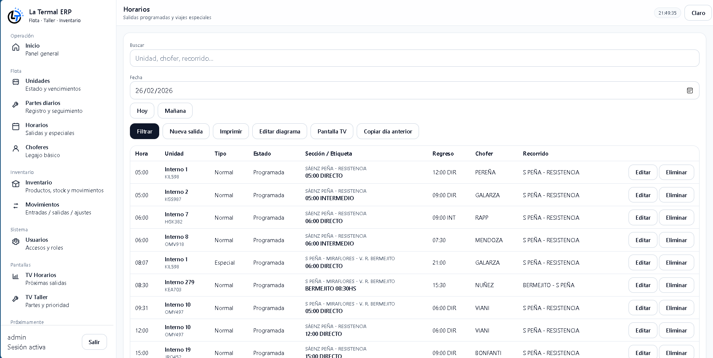
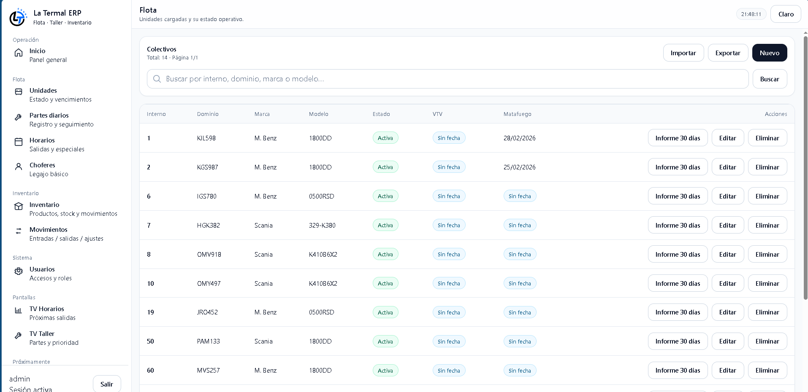

# Manual de Usuario — La Termal ERP

Este manual describe el uso del sistema en operación diaria (offline-first).

## 1) Ingreso al sistema

1. Abrí el acceso del sistema (PC local o LAN).
2. Ingresá usuario y contraseña.
3. Si la contraseña es incorrecta se muestra “Usuario o contraseña inválidos”.

Imagen de referencia:

## 2) Inicio (Dashboard)

- Resumen operativo (inventario, flota, movimientos).
- Accesos rápidos a Horarios, Partes, Inventario, Unidades y Choferes.

## 3) Horarios (Salidas)

Objetivo: cargar el diagrama del día y ajustar excepciones.

- Filtrar por fecha y buscar por unidad/chofer/recorrido.
- Acciones:
  - Nueva salida: alta/edición.
  - Editar diagrama: cambios rápidos de unidad y chofer.
  - Generar base: crea el diagrama del día a partir de una plantilla existente.
  - Copiar día anterior: copia el diagrama del día anterior (omite duplicados).
  - Pantalla TV: vista legible para pantallas grandes.

## 4) Pantallas TV

### TV Horarios
- Muestra el diagrama del día seleccionado.
- Botón “Pantalla completa”.

### TV Taller
- Lista partes abiertos/en proceso priorizados por próxima salida.

## 5) Inventario
- Productos, stock y movimientos.

## 6) Usuarios y roles (Superusuario)
- Alta/baja/edición.
- Asignación de rol (módulos visibles y permisos).
- El comando `python manage.py init_roles` recrea grupos/permisos base.

## 7) Backups
- Backup diario de `db.sqlite3` y `media/` (si aplica).

## 8) Seed (export/import)
- Exportar datos: `python manage.py export_seed --out seed/seed_export.json`
- Importar datos: `python manage.py import_seed --in seed/seed_export.json`
